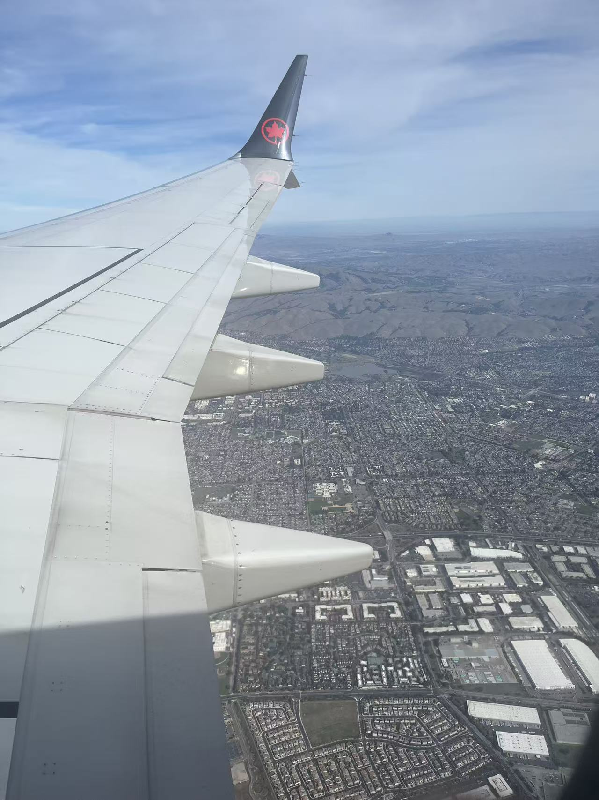
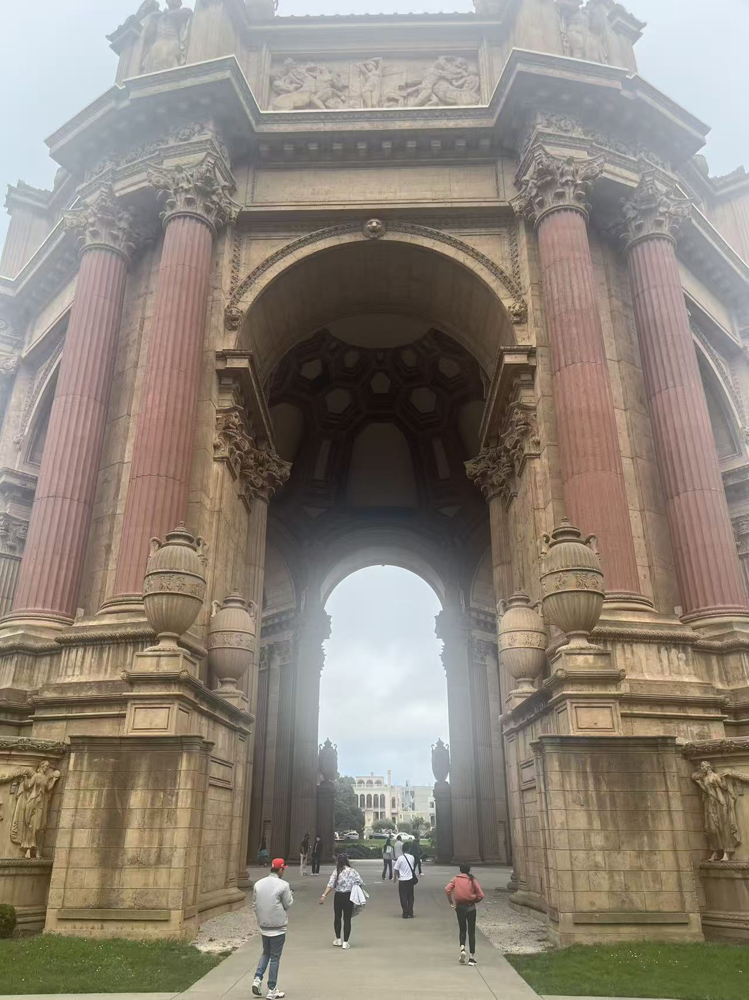

This is the first blog I've written to record my personal experiences. I plan to write more regularly from now on.

From Waterloo to San Francisco, I embarked on one of the craziest journeys of my life during midterm season. This post captures my three days at Cal Hacks 12.0, filled with chaos, exhaustion, and a deep sense of fulfillment.

     
    <video src="https://drive.austinjiang.com/f/Gdig/story.mp4" controls width="600"></video>
     
    (this is my COMMST 223 homework)

## Introduction

Cal Hacks 12.0 (October 24–26) was the second hackathon I've ever joined. The first one was AdventureX in China during the previous summer, known as the largest hackathon in the country. It was a 72-hour event, and to my surprise, my team won the Ten Framework First Place award. The experience left me both thrilled and hungry for more. So when the semester began at Waterloo, I signed up for more hackathons.

When I applied for Cal Hacks, most of my essay responses were copied from my Tree Hacks application. I submitted it quite early, but I initially got deferred to the regular round. A few days later, I received the acceptance email.

I was excited when I got in, but then I realized a serious problem: Cal Hacks took place right after our Reading Week, meaning I would have to fly from Waterloo to San Francisco and back within a single weekend, missing Friday classes. Even worse, it was right in the middle of midterm season. I had my Math 147 exam two days before Cal Hacks and my CS 145 exam the day after returning.

I had to choose between staying home to prepare for CS midterm or flying across the continent for the hackathon. At that moment, I remembered something I deeply believe in: life is a journey. There will be countless exams, but not many chances to cross a continent for a weekend. And so, without much hesitation, I booked that flight across the continent.

There were still two weeks left before Cal Hacks, but I didn't think about any project ideas and hadn't found teammates yet. Partly because I was busy preparing for Math 147 (which I ended up getting full marks on 😆), and partly because I wanted to see what it would be like to come up with an idea entirely on the spot.

On the night before the hackathon, October 23, I finally finished everything else on my to-do list around 3 a.m. I spent the next thirty minutes buying my ticket from Waterloo to YYZ, went to bed at 4, and woke up again at 5...

## Departure for San Francisco

After sleeping for just an hour, I got up, ate the leftover dinner from the night before as breakfast, took a quick shower, and headed out. Honestly, I've had this kind of schedule plenty of times before, so it didn't really bother me. I reached Kitchener at 6:30, took a FlixBus, and arrived at YYZ airport by 7:30 sharp. I waited there until 8, did my Nexus interview, and then went through security to the boarding area.

For this trip to SFO, I wore my UWaterloo hoodie that I had bought on campus. At the border, an older officer noticed it and started chatting with me about my school. During Cal Hacks, several people also noticed the hoodie and spoke highly of Waterloo. Finally, at 10 a.m., I boarded the flight.

As soon as I sat down, I fell into a deep sleep. When I opened my eyes again, the plane was already descending toward SFO. It was 12:30 p.m. local time, after a five-hour flight and a three-hour time difference between Toronto and San Francisco.

By the way, this was my second time visiting San Francisco. The first time was during the summer of Grade 11, right after I finished the Wolfram Summer Research Program in the U.S. After that, my mom and I toured a few universities known for computer science. We visited UC Berkeley and Stanford — both of which ultimately rejected me :(

Anyway, that's not the point. After arriving at SFO, I quickly got on the BART, the city's main train system. But my first destination wasn't the Palace of Fine Arts (this year's Cal Hacks venue). It was my friend's startup.

## Visiting Something Great

Yes, you read that right, the company is literally called *Something Great*. The first time I heard the name, I was surprised too. It was founded by Ryan Zhu, a student at USC and also the founder of AdventureX, which happens to be China's largest hackathon and the first one I ever joined.

A while ago, Ryan and his cofounder Daniel from UPenn's M&T program reached out to me, asking if I was interested in joining their team. I completed the coding challenge for their GMT Engineer position and even received an offer. But honestly, I had not yet decided whether to join them, mainly because I have been too busy with school and my URA research work. So when I came to San Francisco, I thought it would be a good chance to visit and see what their startup was like in person.

Anyway, that is enough of a detour. Let us get back to Cal Hacks.

## Heading to Cal Hacks

After visiting Something Great, I took a bus to the Palace of Fine Arts.

Once I arrived, it was time to find teammates. I walked around the sponsor booths, talking to people and asking if they still needed team members. Unfortunately, almost everyone had already formed their groups. I started to regret not finding teammates earlier.

I then checked the #team-formation channel on Slack. One of the most recent messages was from a computer science student at UBC. I sent him a message, and we met in person at the venue. His name was Anish, and he did not have a team either. We decided to pair up and look for two more members. He later on became my first friend from Nepal.

At that moment, a friend of mine from Berkeley saw my Instagram story and realized I was nearby. We met up, and it turned out that her team also had only two people because two of their members had not shown up. So, our two small teams decided to merge.

My friend from Berkeley, Celine, was actually my old neighbor. Her mom and my mom are friends, and we even went to the same high school, though she is four years older than me. And just like that, our team was formed: me, Anish, Celine, and Kim, another Berkeley student.

## Cal Hacks Begins

3... 2... 1... As the countdown on the big screen reached zero, Cal Hacks officially began at 6 p.m.

I suddenly realized I had been using my phone hotspot the entire time and needed to connect to WiFi. I found the WiFi name and password on Slack, entered them, and waited. After a long pause, the connection failed. What? I checked carefully, typed the password again, and it failed once more. Then I saw messages flooding Slack — apparently too many people were trying to connect, and the organizers said there was nothing they could do. Nothing they could do? This was UC Berkeley's biggest hackathon with nearly three thousand participants, and we had no WiFi? That was unbelievable. For a moment, I started to regret coming all the way here. Without WiFi, there was nothing we could build.

Fortunately, two of our teammates were from UC Berkeley. Celine suggested that we go to her student apartment and work in the study room there. So, Anish and I followed Celine, while Kim decided to work from home. We agreed to communicate through Discord.

On the way, Celine introduced us to Waymo, San Francisco's autonomous ride service. I had never been in a self-driving car before, so I downloaded the app and requested one. A few minutes later, a driverless Waymo arrived to pick us up. It was incredibly cool: the car was spotless, modern, and even let us play music. It was an experience I had never had before, and I hope it spreads across North America soon. Waymo dropped us off at the BART station, and we took the train the rest of the way.

Once we arrived at the study room, we sat down on the sofa and started brainstorming project ideas. Everyone had different suggestions, but I proposed one shared principle: we should pick a sponsor track to target, ideally one with fewer competitors. Everyone agreed. After carefully reviewing all the sponsor tracks, we decided on Bright Data. It was less well-known compared to Cursor or Claude Code, and it offered three separate prizes, while most other tracks had only one. That gave us a much better chance.

For the rest of the day, I began shaping our project idea, starting from Bright Data's capabilities. Bright Data provides developers with a powerful web scraping infrastructure, offering a wide range of APIs. These include proxies to avoid IP bans, a SERP API that simulates search engines, a Web Unlocker API for rendering dynamic pages, a Browser API for simulating user behavior, and even data pipelines for collecting real-time information from different platforms. My goal was to use as many of their APIs as possible.

That led me to an idea: to build a framework for an AI agent with internet access. The agent would be able to browse and retrieve information on its own. The internet access layer would rely on Bright Data, which is our main target for the sponsor prize. With this framework, we could extend it to many different applications: for instance, an agent that makes music by studying the latest trends, or one that summarizes recent research papers. For the agent itself, I suggested combining Reka, Letta Cloud, and Composio.

Everyone agreed with the plan, so this became our official project. By then, it was already 11 p.m. Celine went back to her room, while Anish and I stayed in the study room for the night (thanks to Celine for letting us stay). Anish quickly fell asleep on one of the chairs, and after exploring Bright Data for a while, I decided to leave the rest of the work for the morning. Little did we know what was coming next.

At 1:30 a.m., while I was half asleep in the chair, Anish and I were suddenly startled awake by the dorm administrator. He demanded our residence cards, which we didn't have. Then he asked for our student IDs, which we also couldn't provide. So, at 1:30 in the morning, we were kicked out of the building and left standing on the streets of Berkeley, completely lost. I messaged Celine, and she came downstairs quickly, but it was clear we couldn't stay there for the night.

Thankfully, Anish called an Uber and said his uncle lived in San Francisco. He offered to let me stay with him. I was incredibly grateful. We drove to his uncle's house, and since it was already late, we went straight to sleep. What a night — it was both terrifying and unforgettable.

## Day 2

The next morning I woke up around 10 a.m. Following Anish's suggestion I took a shower and had breakfast, bread and eggs, which I really appreciated. We sat down at his dining table and started working. I began implementing the API layer. After coding for a while something felt missing. Only two of us were working together while the other half of our team was elsewhere. Then Kim messaged us that she had returned to the Palace of Fine Arts and that the WiFi there was finally usable, not perfect but good enough. Maybe everyone else had gone back too, forcing the organizers to fix it. So we decided to drive back to the Palace of Fine Arts.

By 1 p.m. we arrived. The WiFi was indeed much better, at least stable enough to work. After dividing up our tasks I was responsible for the agent logic and internet integration, Celine handled backend and frontend connections, and Kim and Anish focused on the frontend. Then I continued working.

I implemented the search functionality using Bright Data's SERP API first. For each search result link I added three different crawling strategies based on Bright Data's proxy, web unlocker, and browser APIs. If one failed, the system automatically switched to the next. This approach maximized efficiency and minimized cost. My goal was to demonstrate the most extensive use of Bright Data's APIs to win the Best Use of Bright Data award. Since every fetched webpage contained a lot of irrelevant text, I added an extra LLM layer to summarize each page's content. After that I started working on enabling the agent to switch between different search strategies automatically.

By the time I finished that part it was already 6 p.m. Except for Kim who went home, the rest of us decided to return to Celine's student apartment to stay up all night together. This time, since Celine would be there with us, we would not get kicked out.

Anish drove us back to Berkeley. It took a while to find parking, so we decided to get drinks at Heytea. Celine kindly treated me, and I thanked her sincerely. After that we had dinner at a Japanese ramen place nearby. Once we finished, we went back to the study room, ready for another long night of work.

## The Final 12 Hours

We had to submit our project by 9:30 a.m. on Sunday. Sitting down again to work, I finished the core part of the agent. For our LLM API, we chose Reka since they were also one of the event sponsors. At this point, given any task or question, our agent could automatically select the most suitable search strategy and return the relevant information.

Because the internet enabled agent was just the core system, we needed to wrap it in a practical application. Celine decided to build an app that could display the recent price changes of any stock. The agent would then search for the latest news or social media discussions about that company to explain why the stock had moved the way it did.

With some AI assisted coding, I quickly completed the backend interface for the agent, while Anish and Kim finished the frontend. By then Anish was exhausted, so he went to his car to take a nap. That left Celine and me to polish the remaining details.

I soon completed the API for fetching stock information using the Python library yfinance, which Celine had just learned about from someone in her dorm. I integrated it into the frontend, and by that time it was already 2 a.m. During the night, we made two trips to a nearby McDonald's. Celine kindly bought me an ice cream, which I really appreciated.

At 3 a.m., there was only one feature left, having the AI assign a credibility score to each news source. Honestly, by then we were too tired to keep coding. I suggested a simpler solution, a random number generator centered around 70 that produced a score for each source. The reasoning was simple. Each judge would only spend three to five minutes at a booth. They would not have time to inspect the implementation in detail, especially for such a small feature.

A few hours later, Anish woke up. Since we had to leave for the Palace of Fine Arts by 7 a.m., we spent the next two hours finishing our Devpost submission. Celine handled most of the setup, while I recorded a video explaining how we used Bright Data, since it was our main sponsor track and I understood that part best. I had to do it quickly, because my flight from SFO was at noon, meaning I had to leave the venue by 10 a.m. and would miss the judging session.

In the final thirty minutes before submission, we finally completed everything. Celine clicked Submit on Devpost, and her account was instantly suspended. The platform claimed we had uploaded inappropriate content. To this day we still have no idea what happened, and the only logical explanation is that Devpost glitched. Kim resubmitted the exact same project, and this time it went through successfully. The only difference was that we removed this gif:

Lmao, pretty funny, isn't it.

Anish drove us back to the Palace of Fine Arts. By that time my work was mostly done, and I still had about thirty minutes before leaving for the airport. So I walked around the venue and met my high school friend Eric. He had also flown all the way from the University of Toronto to join the hackathon and had just pulled an all-nighter. His team's project was impressive, an anti cheating tool that used a camera to track a person's eye movements during online interviews.

I introduced Celine to Eric, and to my surprise, Eric immediately recognized her. Celine had been his mentor when he was in eighth grade. I was completely shocked. The world suddenly felt very small, especially since Celine is four years older than me. Celine was just as surprised as I was.

## Leaving San Francisco

After chatting for a while, I took a ride to the airport. I ate breakfast there and boarded the plane soon after, immediately falling asleep. Out of the three days of this trip, I probably spent two of them sleeping on planes, totaling only about five hours of rest. When the plane began descending, my phone reconnected to the internet, and I received a message from my teammates saying that we did not win. I felt a bit disappointed, but not for long.

When I landed at YYZ around 7 p.m., I bought a FlixBus ticket to Kitchener, expecting to arrive by 10. Unfortunately, traffic on the highway was heavy, and I did not arrive until 11:30. After getting off the bus, I took public transit back to my dorm. Before heading in, I stopped by the fried chicken shop across the street and bought dinner to take home.

## Conclusion

Overall, it was far from a perfect experience, but it was definitely one of the most special ones in my life so far. When I received the message that we did not win, I felt a brief moment of disappointment, but it quickly faded away. Winning was one of my goals, but it was never the only one. Looking back, I had not prepared much before the hackathon and had not even formed a team in advance, so the result made perfect sense.

More important than the outcome was the journey itself. Over that weekend, I challenged myself by traveling across a continent alone. Even though midterms were all around me, I still chose to go, and that decision alone was worth remembering. I believe that having this kind of courage will give me strength in whatever I do in the future.

During these three days at Cal Hacks, I not only saw countless opportunities from startups but also met many people who truly love building things. Some of them might become future collaborators or even partners in entrepreneurship. I also reconnected with friends in person and had inspiring conversations about technology, ambition, and life.

In the end, experiences like this are incredibly rare. They remind me how much joy there is in creating something out of chaos and exhaustion. If I ever get the chance again, I would choose this journey without hesitation.

## Photos

:::masonry
{
  "items": [
    {
      "id": "1",
      "img": "./files/1.jpg",
      "url": null,
      "height": 600
    },
    {
      "id": "2", 
      "img": "./files/2.jpg",
      "height": 600
    },
    {
      "id": "3", 
      "img": "./files/3.jpg",
      "height": 400
    },
    {
      "id": "4", 
      "img": "./files/4.jpg",
      "height": 300
    },
    {
      "id": "5", 
      "img": "./files/5.jpg",
      "height": 400
    },
    {
      "id": "6", 
      "img": "./files/6.jpg",
      "height": 500
    }
  ],
  "columns": 3,
  "ease": "power3.out",
  "duration": 0.6,
  "animateFrom": "bottom"
}
:::